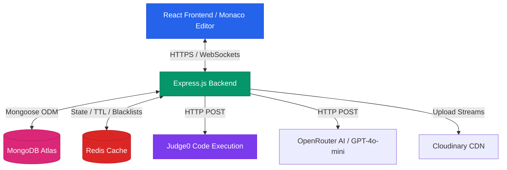
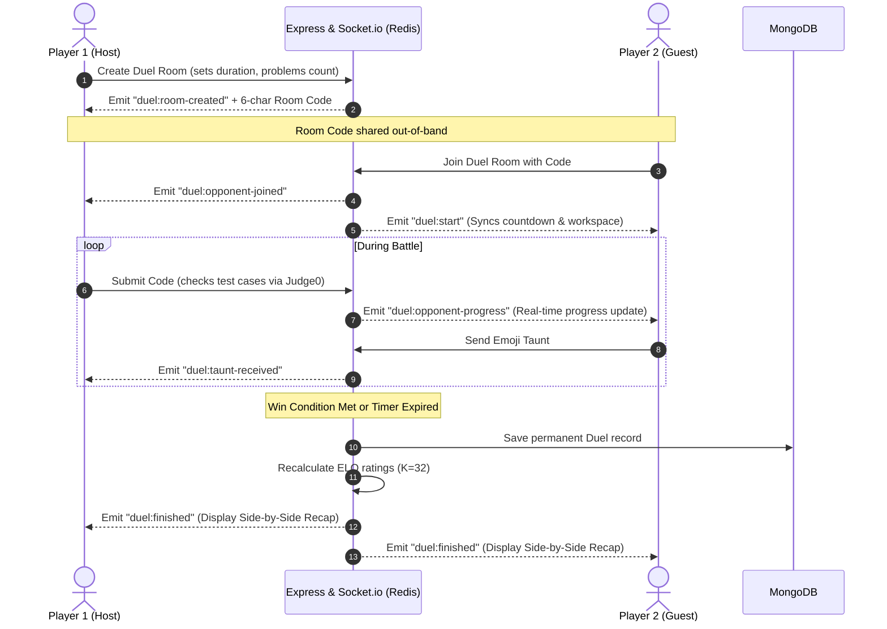
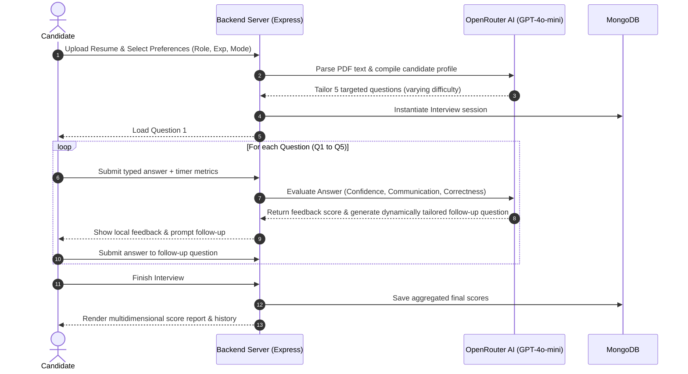
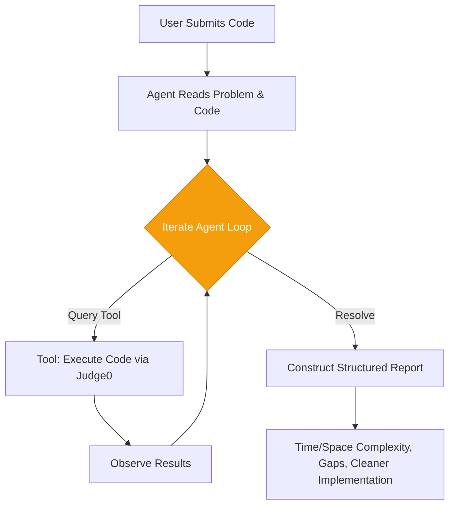
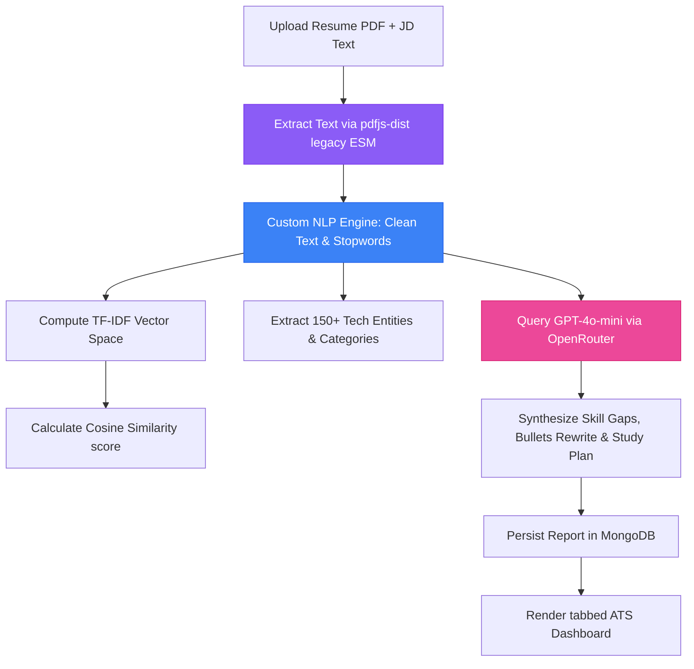

# 🧠 CodeArena — Full-Stack DSA Practice & Interview Platform

CodeArena is a production-grade developer preparation and competitive programming platform. It consolidates standard LeetCode coding features, real-time 1v1 multiplayer dueling, multi-agent AI code reviews, progressive hint generation, an NLP-based ATS Resume Analyzer, and a fully interactive AI Mock Interview workspace under a single, unified codebase.

---

## 🗺️ System Architecture

CodeArena is built on a distributed, stateful architectural model using a React frontend and an Express/Socket.io backend, supported by MongoDB for persistent data and Redis for real-time cache, ELO Standings, and transient socket states.



---

## ✨ Exhaustive Feature Walkthrough

### 1. 🏠 Core DSA Workspace
*   **Authentication & Security:** Implements JSON Web Tokens (JWT) stored in HTTP-Only, Secure, SameSite cookies. Logged-out tokens are blocklisted instantly inside Redis using TTL-based keys to prevent replay attacks.
*   **Problem Index & Navigation:** An advanced filter panel allowing users to slice and dice challenges by Difficulty (Easy, Medium, Hard), Category Tags (Arrays, Graphs, DP, Trees, Strings), and Solved status. Includes real-time fuzzy search.
*   **Monaco Workspace:** Embeds Microsoft's Monaco editor. Features multi-language syntax highlighting, tab configuration, full-screen mode, and isolated per-language code buffers that prevent users from losing progress when switching between languages (C++, Java, JavaScript).
*   **Sandboxed Execution (Judge0):** Code is packaged and shipped to a Judge0 microservice. Outputs include compile logs, stderr, stdout, execution time, memory usage, and failure indicators.
*   **Persistent Submission Tracking:** Stores all run history, allowing users to browse their past code via an inline modal.

### 2. ⚔️ Real-Time 1v1 Code Duels
Users can challenge each other in head-to-head coding battles with immediate ratings updates.



*   **Redis Room Registry:** Duel rooms are initialized in Redis. Room membership, active scores, question lists, and timers are updated in-memory to guarantee sub-millisecond latencies.
*   **Live Progress Feed:** When an opponent passes a test case, a socket event updates a localized progress bar on the competitor's screen without leaking their code.
*   **Early Termination Detection:** The room monitor continuously checks if the leading player has gained enough points to make it mathematically impossible for the opponent to win, immediately ending the duel to save time.
*   **ELO Leaderboard:** Uses the standard Chess rating algorithm ($K=32$) to recalculate standings on duel completion. Stands are rendered on a public global leaderboard.

### 3. 🎙️ AI Mock Interview Workspace
A full simulation setup that replicates an industry-level interviewer conducting behavioral or technical rounds.



*   **Resume Profile Parsing:** Uploaded resume PDFs are parsed server-side. The textual content is dispatched to GPT-4o-mini to extract a clean JSON schema of candidate roles, experiences, tools, and technical project scopes.
*   **Adaptive Question Compiling:** Generates exactly 5 structured questions calibrated dynamically based on the candidate's chosen role, seniority level, and target mode (e.g., pure technical coding, system design, or behavioral/STAR format).
*   **Granular Answer Grading:** Evaluates typed responses across three core metrics (0-10):
    *   *Confidence* — Assertiveness, clarity of stance, and structural layout.
    *   *Communication* — Articulation, simplicity, and lack of verbosity.
    *   *Correctness* — Technical accuracy and alignment with best practices.
*   **Real-Time Smart Follow-Ups:** In addition to immediate grading, the engine analyzes the candidate's response and dynamically spawns a localized follow-up question. If the response was weak, it prompts for clarification; if strong, it goes technically deeper.
*   **Multi-Dimensional Reports:** Provides final visual progress bars, aggregate scores, question-by-question response logs, and a full analysis history panel.

### 4. 🤖 AI Capabilities & Multi-Agent Reviews
*   **AI Code Review Agent (ReAct Pattern):** Built using an iterative agent loop that can query tools. When code is submitted, the agent runs it, diagnoses semantic and logical failures, generates test fixes, verifies them, and writes structured code diagnostics.



*   **Progressive AI Hints:** Problems are equipped with 3 levels of hints (Conceptual, Mathematical/Algorithmic, and Code Blueprint). To reduce API consumption, the system generates all three hints in a single call on first query and caches them in Redis for 24 hours.
*   **DSA Chat Tutor:** A sliding panel allowing real-time chat with an AI assistant loaded with context about the active problem description, user constraints, and active code buffers.

### 5. 📄 ATS Resume Analyzer
An automated parsing and analysis system for checking resumes against modern Applicant Tracking Systems.



*   **ESM-Compatible PDF Extraction:** Integrates Mozilla's `pdfjs-dist` (v5+) legacy build, loaded asynchronously via dynamic module imports to resolve ES Module requirements inside Express's CommonJS environment.
*   **NLP Similarity Computation:** Implements custom TF-IDF (Term Frequency-Inverse Document Frequency) calculations and cosine similarity vectors to calculate an unbiased matching score.
*   **Entity Categorization:** Features an automated lexer that extracts and counts matches for over 150 frontend, backend, database, and devops tools.
*   **AI Rewrite & Study Recommendations:** The AI extracts weak descriptions, replaces them with high-impact action verbs, compiles present/missing keywords, and outlines a prioritized study schedule with time estimates.

---

## 🗂️ Detailed Directory Map

```
leetcode-project/
├── backend/
│   ├── index.js                  ← Server bootstrapping, middleware registration, rate limiters
│   ├── .env.example
│   └── src/
│       ├── agents/
│       │   └── codeReviewAgent.js   ← ReAct agent execution loop & Judge0 tools
│       ├── config/
│       │   ├── db.js             ← MongoDB Mongoose connection
│       │   └── redis.js          ← Redis cluster client initialization
│       ├── controllers/
│       │   ├── agentController.js  ← Handles review triggers
│       │   ├── atsController.js    ← Resume uploads, PDF parser, AI rewrite & histories
│       │   ├── hintController.js   ← Hint queries with Redis cache checks
│       │   ├── interviewController.js ← AI Mock Interview state manager & evaluation
│       │   ├── problemCreator.js   ← Admin challenge management
│       │   ├── submit.js           ← Code evaluation handlers (Judge0 interaction)
│       │   └── userAuthent.js      ← Signup, login, logout, & state checks
│       ├── middleware/
│       │   └── authMiddleware.js   ← Cookie verification & user attachment
│       ├── models/
│       │   ├── atsAnalysis.js      ← ATS match reports database schema
│       │   ├── Duel.js             ← Duel match historical record
│       │   ├── interview.js        ← AI Mock Interview schema (scores, follow-ups)
│       │   ├── problem.js          ← DSA problem details, testcases, & templates
│       │   ├── submission.js       ← Historical code evaluations
│       │   └── user.js             ← User profiles, ratings, streaks, & active states
│       ├── routes/
│       │   ├── agent.js            ← Route: /agent
│       │   ├── aiChatting.js       ← Route: /ai
│       │   ├── ats.js              ← Route: /ats
│       │   ├── duel.js             ← Route: /duel
│       │   ├── hint.js             ← Route: /hint
│       │   ├── interview.js        ← Route: /interview
│       │   ├── problemCreator.js   ← Route: /problem
│       │   ├── profile.js          ← Route: /profile
│       │   └── userAuth.js         ← Route: /user
│       ├── socket/
│       │   └── duelHandler.js      ← Stateful duel events (create, join, submit, taunt)
│       └── utils/
│           ├── elo.js              ← Duel ELO recalculation math
│           ├── nlpPipeline.js      ← TF-IDF matrices & Cosine Similarity score functions
│           └── problemUtility.js   ← Lower-level Judge0 submissions helper
└── frontend/
    ├── vite.config.js
    └── src/
        ├── components/
        │   ├── ChatAi.jsx          ← AI Tutor sliding panel
        │   ├── DuelBattle.jsx      ← Battle workspace & opponent progress tracker
        │   ├── DuelLobby.jsx       ← ELO rankings & matchmaker configurations
        │   ├── DuelRecap.jsx       ← Side-by-side solution viewer
        │   ├── DuelWaiting.jsx     ← Peer room preparation screen
        │   ├── HintPanel.jsx       ← Progressive hint disclosures
        │   └── ThemeToggle.jsx     ← Global theme switcher
        ├── pages/
        │   ├── ATSAnalyzer.jsx     ← Tabbed ATS dashboard, reports, & upload forms
        │   ├── DuelPage.jsx        ← Duel viewport routing
        │   ├── Homepage.jsx        ← Core problem dashboard & search filters
        │   ├── InterviewEntry.jsx  ← AI Interview intro portal (Resume analysis)
        │   ├── InterviewSetup.jsx  ← Configurations for customized rounds
        │   ├── InterviewLive.jsx   ← Chat dashboard with AI Interviewer
        │   ├── InterviewReport.jsx ← Structured score evaluations
        │   ├── InterviewHistory.jsx← User's historical rounds panel
        │   ├── LandingPage.jsx     ← Product introduction page
        │   ├── ProblemPage.jsx     ← Code editor workspace & testcases
        │   └── ProfilePage.jsx     ← Heatmaps, difficulty counts, & streaks
        ├── socket/
        │   └── socket.js           ← Unified socket client instance
        └── store/
            ├── authSlice.js        ← Redux auth states (login, checkAuth)
            └── duelSlice.js        ← Redux duel room status
```

---

## 🏗️ Technical Implementation Details & Design Decisions

### State Management & Real-Time Sync
*   **Dual-Layer Storage for Duels:** The application stores transient, high-frequency actions (room state, player sockets, active countdowns) inside Redis. The MongoDB database is only updated once at the end of the duel, protecting the database from high write volumes.
*   **Websocket Authentication:** Sockets cannot safely extract cookies on all modern browsers due to strict cross-site configuration policies. The application resolves this by fetching a single-use token via an HTTPS call to `/user/get-token`, passing it inside `socket.handshake.auth.token` during initial synchronization.
*   **Dynamic Theme Switching:** Synchronized using a `MutationObserver` on `document.documentElement` class attributes. When dark or light modes are toggled, all system modules (including the Monaco editor environment) adapt automatically without triggering page refreshes.

### ESM Compatibility in CommonJS (PDF.js Integration)
*   **Asynchronous Dynamic Loading:** Mozilla's `pdfjs-dist` (v5+) uses ES Modules, which throws a load exception when loaded using standard CommonJS `require()`. We resolved this by loading the package asynchronously inside [atsController.js](file:///Applications/codexx/backend/src/controllers/atsController.js) and `interviewController.js`:
    ```javascript
    let pdfjsLib;
    (async () => {
        pdfjsLib = await import("pdfjs-dist/legacy/build/pdf.mjs");
        pdfjsLib.GlobalWorkerOptions.workerSrc = require.resolve("pdfjs-dist/legacy/build/pdf.worker.mjs");
    })();
    ```
*   This approach ensures `pdfjs-dist` works reliably server-side in Node.js while keeping startup operations non-blocking.

---

## 📡 API Reference

### 🔐 User & Authentication — `/user`
| Method | Endpoint | Description | Headers/Payload |
|:---|:---|:---|:---|
| `POST` | `/user/register` | Register a new user | `{ firstName, email, password }` |
| `POST` | `/user/login` | Log in and return cookie token | `{ email, password }` |
| `POST` | `/user/logout` | Log out and invalidate cookie | None (Clears cookie + blocks JWT inside Redis) |
| `GET` | `/user/check` | Validate session status | Reads token cookie |
| `GET` | `/user/get-token` | Return JWT for WebSocket authentication | Reads token cookie |

### 📚 Problem Management — `/problem`
| Method | Endpoint | Description | Headers/Payload |
|:---|:---|:---|:---|
| `GET` | `/problem/getAllProblem` | Return list of all challenges | Query parameters for filtering |
| `GET` | `/problem/problemById/:id` | Get full details of a challenge | URL parameter `:id` |
| `POST` | `/problem/create` | Create a new challenge (Admin only) | Form validation schemas |
| `PUT` | `/problem/update/:id` | Edit details of a challenge (Admin only)| URL parameter `:id` |
| `DELETE` | `/problem/delete/:id` | Delete challenge (Admin only) | URL parameter `:id` |

### ⚔️ Duel Operations — `/duel`
| Method | Endpoint | Description | Headers/Payload |
|:---|:---|:---|:---|
| `POST` | `/duel/create` | Instantiate a new duel room | `{ timeLimit, problemCount }` |
| `GET` | `/duel/recap/:roomCode` | Retrieve code outputs of completed duel | URL parameter `:roomCode` |
| `GET` | `/duel/leaderboard` | Get top 20 players by ELO | None |

### 📄 ATS Resume Analyzer — `/ats`
| Method | Endpoint | Description | Headers/Payload |
|:---|:---|:---|:---|
| `POST` | `/ats/analyze` | Upload a PDF resume and optional JD text | Form-Data: `resume` file + `jdText` |
| `POST` | `/ats/rewrite` | Optimize a weak resume bullet point | `{ bulletPoint }` |
| `POST` | `/ats/extract-jd` | Extract description content from URL | `{ url }` |
| `GET` | `/ats/history` | Return user's historical analyses | None |
| `GET` | `/ats/analysis/:id` | Fetch details of a single report | URL parameter `:id` |
| `DELETE` | `/ats/analysis/:id` | Delete analysis | URL parameter `:id` |

### 🎙️ AI Mock Interviews — `/interview`
| Method | Endpoint | Description | Headers/Payload |
|:---|:---|:---|:---|
| `POST` | `/interview/resume` | Upload and extract candidate profile from PDF | Form-Data: `resume` file |
| `POST` | `/interview/generate-questions` | Generate tailored interview session | `{ role, experience, mode, projects, skills, resumeText }` |
| `POST` | `/interview/submit-answer` | Grade single answer + return follow-up question | `{ interviewId, questionIndex, answer, timeTaken }` |
| `POST` | `/interview/finish` | Finalize session and aggregate final scores | `{ interviewId }` |
| `GET` | `/interview/get-interview` | List history of interviews for active user | None |
| `GET` | `/interview/report/:id` | Get details of a single interview report | URL parameter `:id` |

### 🤖 AI Capabilities — `/agent`, `/hint`, `/ai`
| Method | Endpoint | Description | Headers/Payload |
|:---|:---|:---|:---|
| `POST` | `/agent/review/:problemId` | Trigger ReAct Agent code review | URL parameter `:problemId` |
| `POST` | `/hint/:problemId` | Get progressive hint (1, 2, or 3) | URL parameter `:problemId` |
| `POST` | `/ai/solveDoubt` | Chat with DSA tutor contextually | `{ query, problemId, code }` |

---

## 🚀 Setup & Launch Instructions

### Prerequisites
1.  **Node.js** v20.x or higher
2.  **Redis Server** v7.x or higher
3.  **MongoDB Atlas** cluster connection
4.  External credentials for **OpenRouter (AI)**, **Judge0 (Code Execution)**, and **Cloudinary (Video hosting)**.

### Step 1: Environment Variables
Create a `.env` file inside `/backend` modeled on the properties below:
```ini
DB_CONNECT_STRING=mongodb+srv://<user>:<password>@cluster.mongodb.net/codearena
REDIS_URL=redis://localhost:6379
JWT_KEY=your_secure_jwt_secret
OPENROUTER_KEY=your_openrouter_api_key
JUDGE0_KEY=your_judge0_api_key
CLOUDINARY_CLOUD_NAME=your_cloudinary_cloud_name
CLOUDINARY_API_KEY=your_cloudinary_api_key
CLOUDINARY_API_SECRET=your_cloudinary_api_secret
```

### Step 2: Boot Backend
```bash
cd backend
npm install
npm run dev
```
The backend starts listening on **http://localhost:3000**.

### Step 3: Boot Frontend
```bash
cd ../frontend
npm install
npm run dev
```
The client app is initialized on **http://localhost:5173**. Vite will proxy any API calls directly to port 3000.

### Step 4: Admin Promotion
1. Sign up on **http://localhost:5173/signup**.
2. Connect to your MongoDB cluster, select your database, and locate your record inside the `users` collection.
3. Modify the attribute `"role": "user"` to `"role": "admin"`.
4. Log out and sign in again. The Admin dashboard option will appear in your frontend navigation bar.

---

## 📝 License
MIT
